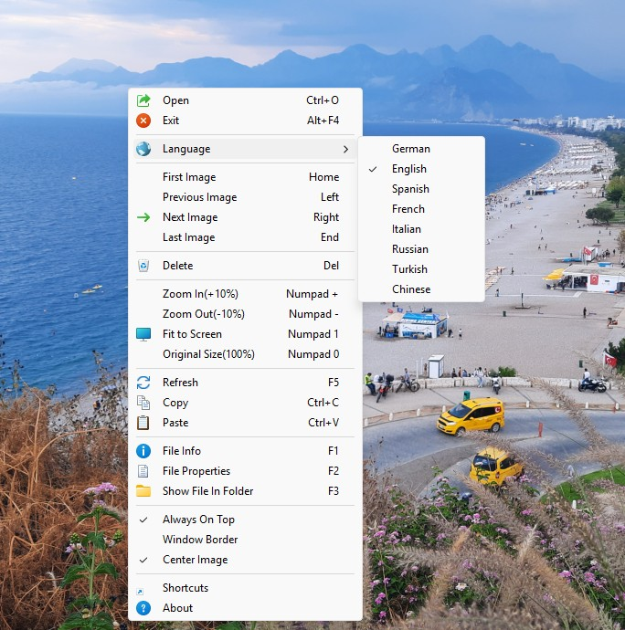

# AS Image Viewer v1.7

 

AS Image Viewer is a minimalist image viewer application that uses GDI+ for rendering. It supports multiple image formats and allows easy navigation and management through a simple GUI interface.

## Features

- Image rendering with GDI+
- Supported formats: JPG, JPEG, PNG, GIF, BMP, TIF, ICO, WEBP, WMF
- Easy navigation: Previous/next image with left/right arrow keys
- Zoom in and out: Using Numpad + and - keys
- Refresh image with F5 key
- Simple and user-friendly interface
- Always on top option
- Center image option
- Right-click menu with icons
- Drag and drop support
- Command line support for opening images
- File information display
- Window border toggle option
- Save last window position, folder and settings
- Language support
- Delete current image
- Copy image to clipboard
- Paste image from clipboard

## Requirements

- Windows (32-bit or 64-bit)
- [AutoHotkey v2](https://www.autohotkey.com/) (only required if running the source code directly)

## Installation

1. Go to the [Releases](https://github.com/mesutakcan/AS-Image-Viewer/releases) page.
2. Download the appropriate executable file for your system:
   - **`AS-Image-Viewer-x64.exe`** (for 64-bit Windows)
   - **`AS-Image-Viewer-x32.exe`** (for 32-bit Windows)
3. Download the [lang](https://github.com/mesutakcan/AS-Image-Viewer/tree/main/src/lang) folder and place it in the same directory as the executable.
4. Run the executable. No installation is required.

## Language Support

The application supports multiple languages through INI files stored in the "lang" folder.
Current supported languages:
- English `en.ini`
- Turkish `tr.ini`
- Russian `ru.ini`
- Chinese `zh.ini`
- French `fr.ini`
- German `de.ini`
- Italian `it.ini`
- Spanish `es.ini`

**There may be errors in the translated texts because they are translated with artificial intelligence.**

### How to add a new language:
1. Copy the `en.ini` file in the `lang` folder as the new language file ini file (e.g. `pl.ini` for Polish)
2. Translate and save all strings in the new INI file.
[Language Codes](https://www.autohotkey.com/docs/v2/misc/Languages.htm)

or more simply:
Translate the contents of the `en.ini` file into the desired language and save it.\
**Lang INI files must be in UTF-16 file format**

### Language INI File Structure:
**[Menu]** Menu item texts\
**[File]** File related messages\
**[Shortcuts]** Keyboard and mouse shortcut descriptions\
**[FileInfo]** File information texts\
**[About]** About dialog texts

## Source Code

The source code for this program is available in the [src](https://github.com/mesutakcan/AS-Image-Viewer/tree/main/src) folder. To use the program source code, you'll need to have AutoHotkey v2 installed on your system. You can run the script directly using the AutoHotkey interpreter. Alternatively, you can compile the script into an executable file for easier distribution.

This application uses the library file [Gdip_All.ahk](https://github.com/buliasz/AHKv2-Gdip/blob/master/Gdip_All.ahk)

## Opening Image File

- **Command Line**: Launch the application with an image file path as a parameter to open it directly.
- **Drag and Drop to Exe File**: Drag an image file onto the executable file to open it immediately.

### Opening File While Running

- **Menu**: Right-click to open the menu and select "Open" to browse for an image file.
- **Keyboard Shortcut**: Press `Ctrl+O` to open the file selection dialog.
- **Drag and Drop**: Drag image files directly onto the application window to open them.

## Usage

1. **Right-Click Menu**: Right-click or press the `Down` arrow key to access the menu and use options
2. **Open Image**: Select "Open" from the right-click menu or drag and drop an image onto the window
3. **Navigation**: Navigate using keyboard shortcuts or menu
4. **Zoom In and Out**: Use the `+` and `-` keys on the Numpad to zoom in and out
5. Use `Numpad0` to return to original size, `Numpad1` to fit to screen
6. **Refresh**: Press the `F5` key to refresh the image

## Shortcuts

### Keyboard Shortcuts

`Down Arrow` : Menu\
`Home`: First Image\
`Browser Back`: Previous image\
`Left Arrow`: Previous image\
`Browser Forward`: Next image\
`Right Arrow`: Next image\
`End`: Last Image\
`Numpad +`: Zoom in\
`Numpad -`: Zoom out\
`Numpad 0`: Original size\
`Numpad 1`: Fit to screen\
`F1`: Image file info\
`F2`: File properties\
`F3`: Show file in folder\
`F5`: Refresh\
`Del`: Delete image\
`Ctrl+O`: Open image file\
`Ctrl+C`: Copy image to clipboard\
`Ctrl+V`: Paste image from clipboard\
`Esc`: Close file info\
`Alt+F4`: Exit App

### Mouse:

**Right click**: Menu\
**Mouse wheel up**: Zoom in\
**Mouse wheel down**: Zoom out\
**4th mouse button**: Previous image\
**5th mouse button**: Next image\
**Left button double click**: Original size\
**Middle button double click**: Fit to screen

## History

- v1.0: 30/07/2024 First version
- v1.1: 11/08/2024
  - Code improvements
  - Added new shortcuts for navigation
  - Improved zoom features
- v1.2: 18/08/2024
  - Code improvements
- v1.3: 25/03/2025
  - Code improvements
  - Added command line support for opening images
  - Added drag and drop support
- v1.3.1: 09/04/2025
  - Minor issues fixed
- v1.4.0: 19/04/2025
  - Added language support (English, Turkish, Russian, Chinese, French, German, Italian)
- v1.5: 22/05/2025
  - Copy image to clipboard
- v1.6: 14/06/2025
  - Code improvements
  - Language support optimization
  - Spanish language support added
  - Added keyboard shortcuts to context menu
- v1.7: 26/05/2026
  - Added paste image from clipboard
  - Added delete image feature
  - Added save settings (window position, center image, etc.)
  - Added icons to right-click menu
  - Improved memory handling when loading files

## TODO
- Rotate image
- Rotate image based on EXIF orientation
- Slideshow
- Zoom to mouse cursor

## License

This project is licensed under the GPL 3.0 License. For more information, see the `LICENSE` file.

## Contributing

Contributions are welcome! If you'd like to add features, fix bugs, or improve the code, feel free to open a pull request.

## Contact

**Author**: Mesut Akcan\
**Email**: <makcan@gmail.com>\
**Blog**: [mesutakcan.blogspot.com](http://mesutakcan.blogspot.com)\
**GitHub**: [mesutakcan](http://github.com/mesutakcan)\
**YouTube**: [Mesut Akcan](http://youtube.com/mesutakcan)
